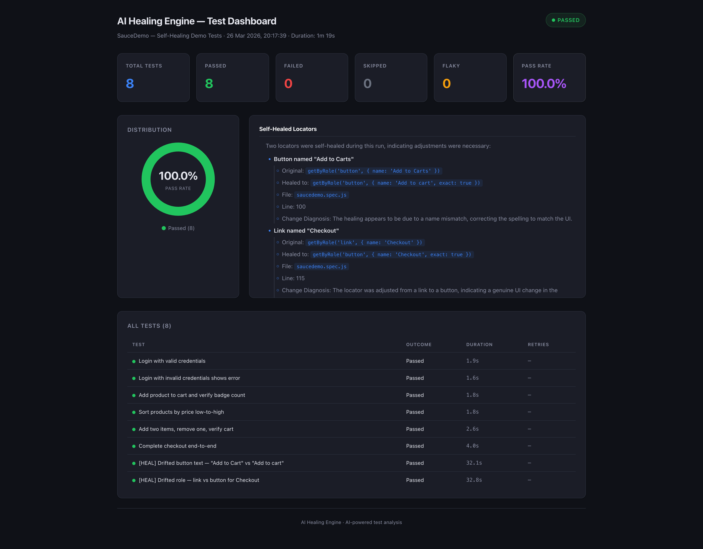

# AI-Powered Playwright Self-Healing Engine

A Playwright test framework that **fixes its own broken locators at runtime** -> so your tests don't fail just because someone renamed a button.

It uses a three-tier healing strategy: fast string similarity matching first, then an AI-powered healer (OpenAI) as a fallback, and a persistent cache so the same fix is instant next time.

> **Disclaimer:** This is an independent portfolio/hobby project. It is not affiliated with, endorsed by, or connected to any current or former employer. I just like building things that solve real problems I've dealt with at work.

---

## The Problem

If you've worked in test automation, you know the pain: a developer changes a button label from `"Submit"` to `"Save"`, or swaps an `<a>` tag for a `<button>`, and suddenly 15 tests fail. The app works fine -> but your locators are stale.

This engine catches those failures **before the test reports a failure** and attempts to heal them automatically.

---

## How It Works

```
Test action fails (e.g. click, fill, etc.)
       |
       v
+-----------------------+
|  Failure Classifier   |---- Not a locator issue? --> re-throw (don't waste time)
+-----------+-----------+
            | looks like locator drift
            v
+-----------------------+
|   Healing Cache       |---- Healed this before? --> instant fix, no API call
+-----------+-----------+
            | cache miss
            v
+-----------------------+
|   Fuzzy Matcher       |---- Close enough? (>= 90% string similarity) --> fix it
|   (Levenshtein)       |     Free. No AI needed.
+-----------+-----------+
            | no fuzzy match
            v
+-----------------------+
|   AI Healer           |---- Reads the live DOM, asks OpenAI to pick
|   (OpenAI gpt-4o)     |     the best matching element
+-----------+-----------+
            |
            v
   Retry the action with the healed locator
   Log everything for the reporter + dashboard
```

### What It Can Heal

| Locator Method | What Goes Wrong |
|---|---|
| `page.getByRole()` | Wrong role, renamed button/link, typos |
| `page.getByText()` | Changed text, typos, whitespace |
| `page.getByLabel()` | Label text drift, aria-label changes |
| `page.getByPlaceholder()` | Placeholder attribute changes |
| `page.getByTitle()` | Title attribute changes |

Chained locators work too (e.g. `page.locator('#panel').filter({ hasText: 'Foo' }).getByRole(...)`).

---

## Self-Healing in Action

Here are real examples from actual test runs showing each tier of healing.

### Tier 1 -> Fuzzy Match (Free, No AI)

When the locator text is close enough (>= 90% similarity), the engine fixes it instantly using Levenshtein distance. No API calls, no cost.

**Role mismatch** -> test says `button`, actual element is a `textbox`:
```
🔧 [AutoHeal] click() failed for: button named "Title*"
   ↳ Attempted: getByRole('button', { name: 'Title*', exact: true })
   ↳ Error: locator.original: Timeout 30000ms exceeded.
   ↳ Attempting healing (fuzzy pre-check → AI fallback)...
   ⚡ [Fuzzy] Deterministic match: role="textbox" name="Title*" (similarity: 100%)
   ✅ [AutoHeal] HEALED! Used: getByRole('textbox', { name: 'Title*', exact: true })
```

**Wrong role again** -> test says `link`, still a `textbox`:
```
🔧 [AutoHeal] fill() failed for: link named "Title*"
   ↳ Attempted: getByRole('link', { name: 'Title*', exact: true })
   ↳ Error: locator.original: Timeout 30000ms exceeded.
   ↳ Attempting healing (fuzzy pre-check → AI fallback)...
   ⚡ [Fuzzy] Deterministic match: role="textbox" name="Title*" (similarity: 100%)
   ✅ [AutoHeal] HEALED! Used: getByRole('textbox', { name: 'Title*', exact: true })
```

### Tier 2 -> AI Healer (For the Tricky Ones)

When the text has changed enough that fuzzy matching can't confidently pick a winner, the engine sends the DOM elements to OpenAI and lets it figure it out.

**Title attribute changed** -> someone renamed `"file"` to `"Image"` in the UI:
```
🔧 [AutoHeal] click() failed for: title "Some Shipwreck file"
   ↳ Attempted: getByTitle('Some Shipwreck file')
   ↳ Error: locator.original: Timeout 30000ms exceeded.
   ↳ Attempting healing (fuzzy pre-check → AI fallback)...
   🤖 AI response: {"index": 45, "confidence": 80, "reasoning": "The title 'Some Shipwreck
      Image' is similar to the searched title 'Some Shipwreck file', suggesting a possible
      change in the title text."}
   🎯 AI suggests: "Some Shipwreck Image" (confidence: 80%)
   ✅ [AutoHeal] HEALED! Used: getByTitle('Some Shipwreck Image', { exact: true })
```

**Text content changed** -> `"file name"` became `"asset name"`:
```
🔧 [AutoHeal] click() failed for: text "Start typing file name..."
   ↳ Attempted: getByText('Start typing file name...')
   ↳ Error: locator.original: Timeout 30000ms exceeded.
   ↳ Attempting healing (fuzzy pre-check → AI fallback)...
   🤖 AI response: {"index": 65, "confidence": 80, "reasoning": "The text 'Start typing
      asset name...' is similar in structure and context to the intended text 'Start typing
      file name...', suggesting a possible change in the text."}
   🎯 AI suggests text: "Start typing asset name..." (confidence: 80%)
   ✅ [AutoHeal] HEALED! Used: getByText('Start typing asset name...', { exact: true })
```

### Tier 3 -> Healing Cache (Instant on Re-runs)

Once a locator is healed (by fuzzy or AI), the fix is saved to `.healingCache.json`. Next time the same broken locator is encountered, it's fixed **instantly** -> no fuzzy matching, no API calls, zero cost.

```
🔧 [AutoHeal] click() failed for: button named "Title*"
   ↳ Attempted: getByRole('button', { name: 'Title*', exact: true })
   ↳ Error: locator.original: Timeout 30000ms exceeded.
   📦 [Cache] Found cached healing: getByRole('textbox', { name: 'Title*', exact: true })
   ✅ [Cache] HEALED from cache! Used: getByRole('textbox', { name: 'Title*', exact: true })
```

```
🔧 [AutoHeal] fill() failed for: link named "Title*"
   ↳ Attempted: getByRole('link', { name: 'Title*', exact: true })
   ↳ Error: locator.original: Timeout 30000ms exceeded.
   📦 [Cache] Found cached healing: getByRole('textbox', { name: 'Title*', exact: true })
   ✅ [Cache] HEALED from cache! Used: getByRole('textbox', { name: 'Title*', exact: true })
```

---

## Test Dashboard

After each run, the custom reporter generates a JSON file that powers a React dashboard. It shows pass/fail stats, an AI-generated test summary, failure classification by root cause, and a detailed healing log -> so you can see exactly what broke and how it was fixed.



---

## Failure Classifier

Not every failure is a locator problem. Before the engine tries to heal anything, it classifies the error to avoid wasting time (and API calls) on things it can't fix:

| Classification | Healable? | Example |
|---|---|---|
| Locator Drift | Yes | `"no element matches locator"` |
| Timing / Race Condition | Maybe | `"timeout exceeded"` -> heals only if locator-related |
| Overlay / Intercept | No | `"element is intercepted by another element"` |
| Visibility | No | `"element is not visible"` |
| Detachment | No | `"element is detached from the DOM"` |
| Navigation | No | `"page closed"`, `"frame detached"` |
| Network | No | `"net::ERR_CONNECTION_REFUSED"` |

---

## Project Structure

```
playwright-ai-healing-engine/
├── tests/                       # Playwright test specs
│   └── saucedemo.spec.js        # Demo tests against SauceDemo.com
├── pages/                       # Page Object Models
│   ├── LoginPage.js             # Wires up the healer via LocatorHealer.wrapPage()
│   ├── ProductsPage.js
│   ├── CartPage.js
│   └── CheckoutPage.js
├── shared/                      # Core engine (reusable across projects)
│   ├── utils/
│   │   ├── locatorHealer.js     # The self-healing engine
│   │   └── failureClassifier.js # Classifies errors by root cause
│   └── reporter.js              # Custom reporter + AI summary generator
├── dashboard/                   # React dashboard (Vite + single-file build)
│   ├── src/
│   │   ├── App.jsx
│   │   └── components/
│   └── public/
│       └── test-run-data.json   # Generated after each test run
├── playwright.config.js
├── package.json
└── .env.example
```

---

## Quick Start

### Prerequisites

- Node.js 18+
- An OpenAI API key (for AI healing and test summaries)

### Setup

```bash
git clone https://github.com/varunheranjal/playwright-ai-healing-engine.git
cd playwright-ai-healing-engine

npm install
cd shared && npm install && cd ..
npx playwright install chromium

cp .env.example .env
# Add your OPENAI_API_KEY to .env
```

### Run

```bash
npm test              # headless
npm run test:headed   # watch the browser
npm run test:debug    # step through with inspector
npm run report        # open the HTML report
```

### Dashboard

```bash
cd dashboard && npm install && npm run dev
```

---

## Tech Stack

- **Playwright** -> browser automation and test runner
- **OpenAI API** -> LLM-powered locator healing and test run summaries
- **React + Vite** -> test results dashboard
- **Node.js** -> runtime

---

## License

[MIT](./LICENSE)
